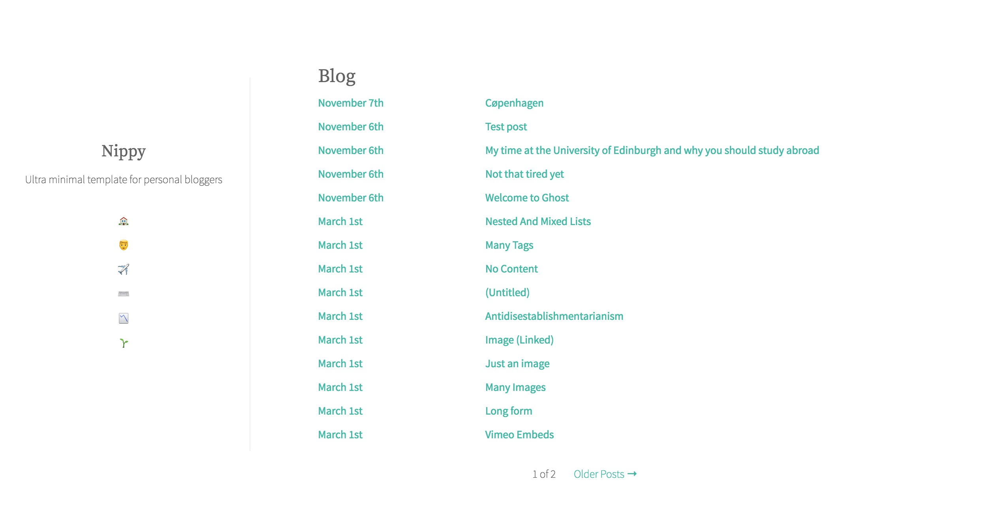
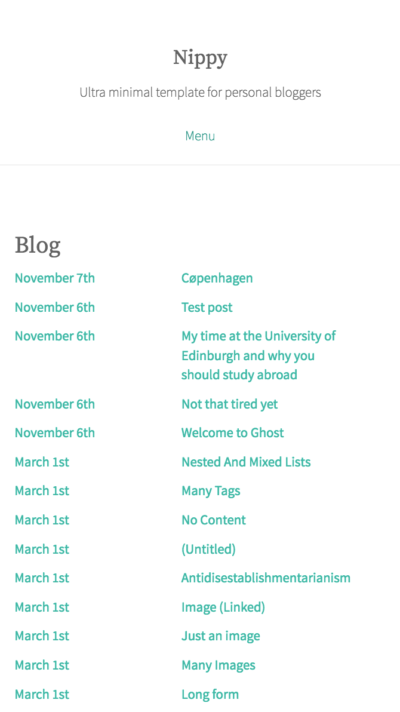

# Nippy (in development)

Custom theme for [Ghost](). Minimal theme meant for personal bloggers.

## Motivation

I really like Ghost as a blogging platform, but I don't like any of the themes, so I decided to create my own. I really like it so far! Here's a screenshot.

Mobile aite too:

# Todo

1. Make the authors pages less shitty
2. Add more screenshots so people know what this looks like
3. Create a 404 page
4. Create AMP Template
5. Add feature for subscribers (Ghost says feature is in Beta)
6. Maybe redo all the CSS into something like Less or Sass?
7. Maybe setup a demo site somehow lol
8. ... Tests?

# Things I'm thinking about

1. What should I do with cover photos? Should I just scrap them all together?
2. Is there a better way than to use raw CSS? CSS is the bulk of the project, but I'm not sure how to auto-compile Less or Sass for this, since that would be kind of annoying for development. I'll probably do some research.
